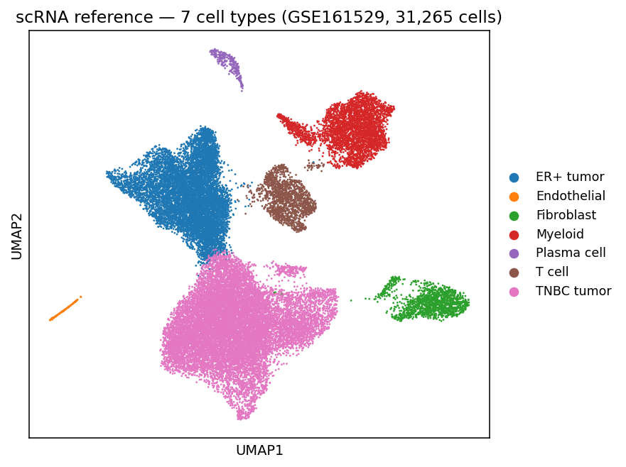
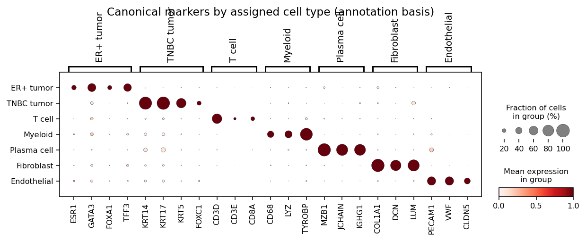
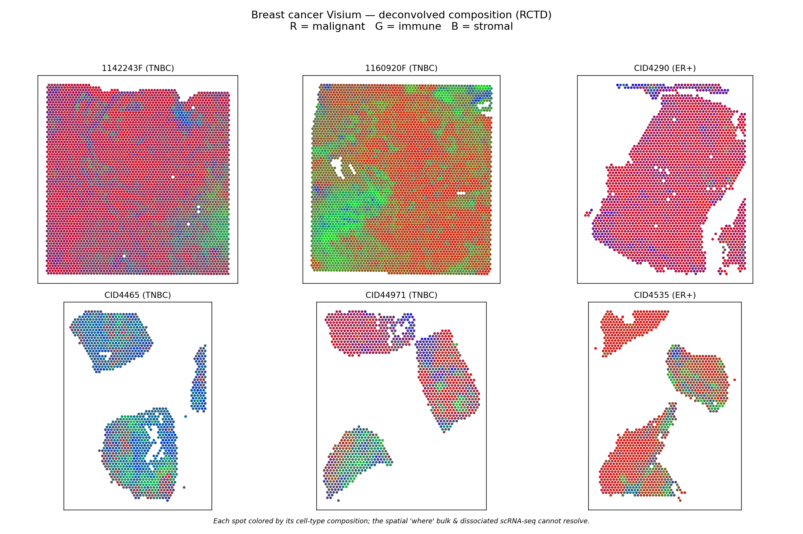
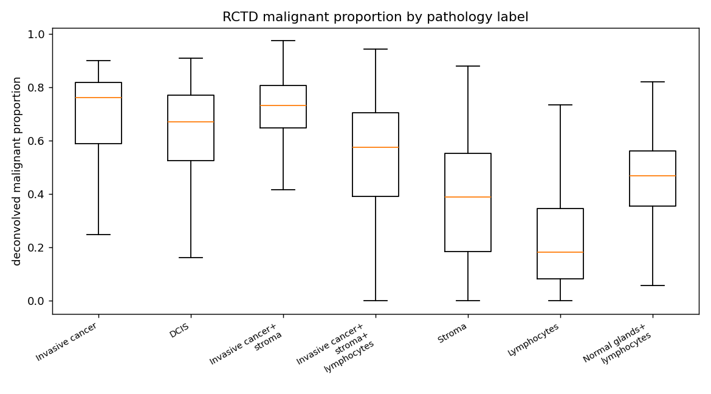
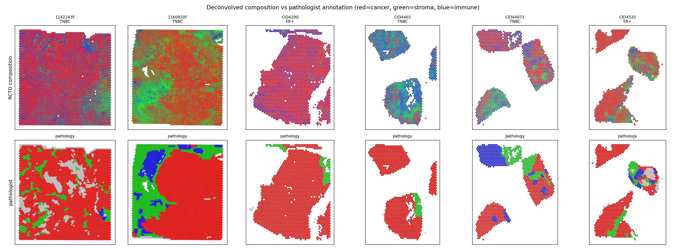
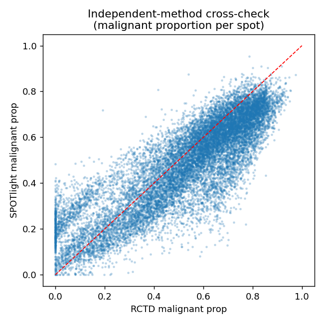
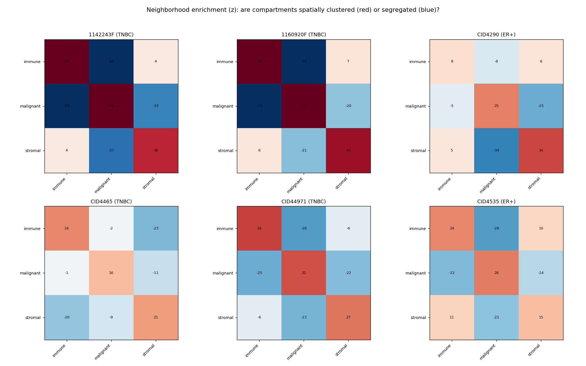
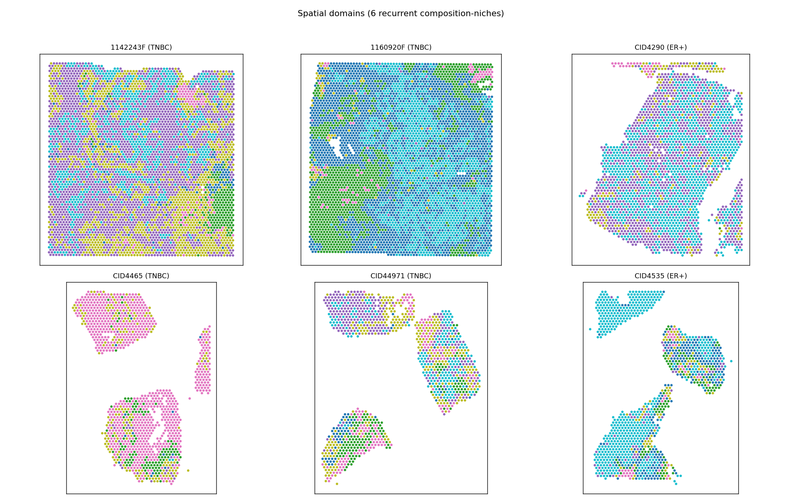
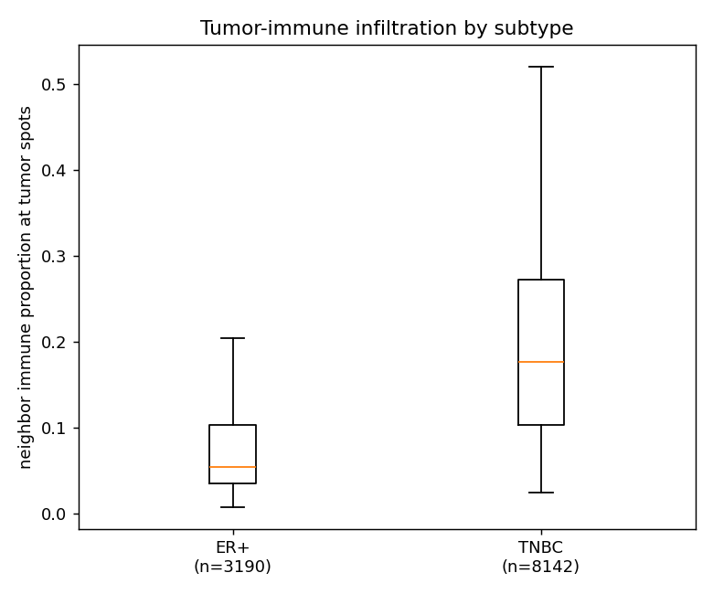

# Spatial Deconvolution and Niche Analysis of the Breast Cancer Tumor Microenvironment
### A detailed methodology and results report

---

## Abstract

We reconstruct the spatial cellular architecture of six human breast cancer sections
(10x Visium) by reference-based deconvolution against an annotated single-cell atlas,
validate the result against independent pathologist annotations, and characterize the
tumor–immune boundary by molecular subtype. Using RCTD (primary) with a SPOTlight
cross-check, per-spot cell-type proportions recover the pathologist's tissue map
(malignant-proportion AUROC 0.75; two independent methods agree at r = 0.87–0.97) and
correctly resolve the ER+/TNBC malignant subtype per section. Spatial niche analysis
(squidpy) shows compartmentalized tissue in which tumor and immune neighborhoods are
spatially segregated, and that immune infiltration at tumor margins is markedly higher in
TNBC than ER+ (median 0.176 vs 0.054, p≈0) — recovering, in tissue space, the clinical
"hot vs cold" phenotype. This is the third stage of a bulk → single-cell → spatial
through-line: bulk found the subtype signature, single-cell localized it to malignant
epithelium and proved malignancy by CNV, and spatial shows *where* the compartments sit
and how the tumor–immune architecture itself differs by subtype.

---

## 1. Background and motivation

Bulk RNA-seq of breast tumors identifies subtype signatures (ER+: ESR1/GATA3/FOXA1;
TNBC/basal: KRT14/FOXC1) but averages over every cell, so it cannot say which cells carry
the signal. Single-cell RNA-seq resolves the cell types and, via inferred copy-number
variation, proves which epithelial cells are genuinely malignant — but dissociation
destroys spatial context. Spatial transcriptomics restores that context: it measures
expression at spatially-registered spots, so we can ask *where* malignant, immune, and
stromal populations sit relative to one another, and whether that architecture differs by
subtype. This project is the spatial capstone of that through-line.

The core analytical task is **reference-based deconvolution**: each Visium spot (55 µm,
typically several cells) is a mixture, and we estimate the proportion of each reference
cell type contributing to it. The deliberate rigor choice is **honest validation** against
an *independent* ground truth — the pathologist's per-spot annotation, which never enters
the deconvolution.

---

## 2. Data

**Single-cell reference — GSE161529 (Pal et al.).** Four whole-tumor 10x samples
(2 ER+: MH0001, MH0042; 2 TNBC: MH0126, MH0135), 31,265 QC-passed cells. Whole-tumor (not
epithelial-sorted) captures retain the full microenvironment. Raw UMI counts are required
for deconvolution (both RCTD and SPOTlight model counts, not log-normalized values).

**Spatial data — Wu et al. 2021, *Nat Genet*; Zenodo 10.5281/zenodo.4739739.** Six primary
breast cancer Visium sections with brightfield images and, critically, per-spot pathologist
`Classification` labels used as ground truth.

| Section | Subtype | Genes | Spots (annotated) |
|---------|---------|------:|------:|
| 1142243F | TNBC | 28,402 | 4,784 |
| 1160920F | TNBC | 28,402 | 4,895 |
| CID4290  | ER+  | 19,237 | 2,432 |
| CID4465  | TNBC | 19,237 | 1,211 |
| CID44971 | TNBC | 19,237 | 1,162 |
| CID4535  | ER+  | 19,237 | 1,127 |

*Data notes / gotchas.* The Zenodo DOI is **4739739** (a commonly-cited 4739749 does not
resolve). Wu's `*.gz` matrix files are **plaintext despite the extension**, requiring a
stream-based MatrixMarket read that bypasses gzip auto-detection. Visium barcodes repeat
across sections, so all cross-section joins are keyed on `section + barcode`.

---

## 3. Workflow overview

```
GSE161529 counts ─▶ 01_build_reference.py ─▶ reference_annotated.h5ad (counts + 7 types)
Wu Visium (Zenodo) ─▶ 02_prep_visium.py  ─▶ per-section h5ad + R handoff (mtx/csv) + mgs
                                    │
                 ┌──────────────────┴───────────────────┐
        03_run_rctd.R (RCTD, primary)        04_run_spotlight.R (SPOTlight, cross-check)
                 │                                        │
                 └────────── proportions CSV ─────────────┘
                                    │
   05_validate.py (vs pathology) ── 06_figures.py (hero) ── 07_niche_analysis.py (Part B)
```

The pipeline crosses a deliberate **R ↔ Python boundary**: deconvolution runs in R
(spacexr/SPOTlight are R packages), while reference construction, data prep, validation,
and niche analysis run in Python. The handoff is explicit and file-based — Python exports
counts (gzipped MatrixMarket) + barcodes/genes/coords (CSV); R writes per-spot proportion
CSVs; Python reads them back. No serialized cross-language objects.

**Environments.** `spatial-r` (R 4.5.3; `bioconductor-spacexr` 1.2.0, `bioconductor-spotlight`
1.14.0, from prebuilt bioconda binaries — pinned and reproducible); `scrna` (Python; scanpy
1.11.5, harmonypy 0.2.0) for the reference; `spatial` (Python; scanpy 1.11.5, squidpy 1.6.5)
for Part B.

---

## 4. Methodology

### 4.1 Reference reconstruction and cell-type annotation

The original scRNA clustering notebook had lost its Harmony integration step, and its
cell-type calls were keyed to *hardcoded leiden cluster numbers*, which are not stable
across re-runs (an assertion that "every cluster is labeled" does not guarantee correct
labels). Rather than risk a silent mislabeling, we reproduced the same pipeline and the
same seven cell types, but re-derived the cluster→type assignment by a self-validating,
renumbering-robust rule.

Pipeline: normalize to 10⁴ counts/cell → log1p → 2,000 highly-variable genes → scale →
PCA(50) → **Harmony** batch integration on `sample` → neighbors(30 PCs) → **leiden**
(resolution 0.5, 14 clusters). Harmonypy 0.2.0 returns a PyTorch tensor that scanpy's
wrapper mishandles; we call `run_harmony` directly and coerce/orient the corrected
embedding.

**Annotation by marker enrichment.** For each leiden cluster we compute the mean
log-normalized expression of each cell type's canonical marker set, **z-score each marker
gene across clusters** (so signatures are on a common scale — critical: comparing raw
`score_genes` outputs across signatures is invalid and, in an early attempt, mislabeled
every epithelial cluster as endothelial), average per signature, and assign the argmax.
Epithelial clusters are split into ER+ vs TNBC tumor by comparing an ER program
(ESR1/GATA3/FOXA1/AR/TFF3) against a basal program (KRT5/KRT14/KRT17/FOXC1/MIA). Data-driven
top genes (`rank_genes_groups`) are logged alongside each call for audit
(`reference_cluster_evidence.csv`).

The reference is exported with X = raw counts and `obs['cell_type']`, plus a coarse
`obs['compartment']` (malignant = ER+/TNBC tumor; immune = T/Myeloid/Plasma; stromal =
Fibroblast/Endothelial) used throughout validation.

### 4.2 Deconvolution — RCTD (primary)

RCTD (`spacexr`, Cable et al. 2022) models each spot's counts as a Poisson mixture of
reference cell-type expression profiles, with an explicit platform-effect term for the
scRNA↔Visium capture difference. We use the Bioconductor S4 API (`createRctd` → `runRctd`),
**"full" mode** (a full proportion vector per spot, appropriate for multi-cell Visium
spots), `max_cores = 4` (the single-core `fitBulk`/`chooseSigma` hang is avoided). Genes are
intersected between reference and section internally; weights (cell-types × spots) are
transposed and row-normalized to proportions.

### 4.3 Deconvolution — SPOTlight (independent cross-check)

SPOTlight uses seeded non-negative matrix factorization — a fundamentally different
statistical basis from RCTD's regression. Marker genes per cell type (`mgs`) were computed
in Python (`rank_genes_groups` on the reference by cell type, top 100 up-regulated with
log-fold-change weights) and handed to SPOTlight, avoiding an `scran` dependency. Agreement
between the two methods is the rigor signal; disagreement is reported.

### 4.4 Validation against pathology

Pathologist `Classification` labels are compound (e.g. "Invasive cancer + stroma +
lymphocytes"), which we parse into presence flags: malignant (invasive cancer / DCIS /
cancer-in-aggregate), stromal (stroma / adipose), immune (lymphocytes / TLS), normal
epithelium (normal gland/duct), and excluded (necrosis / artefact / uncertain). Tests:

1. **Malignant discrimination** — malignant proportion in cancer-containing vs non-cancer
   spots (Mann–Whitney; AUROC).
2. **Compartment concordance** — stromal proportion in pure-"Stroma" spots; immune in
   pure-"Lymphocytes".
3. **Dominant-compartment confusion** — on single-label spots, does the top deconvolved
   compartment match the pathology primary compartment?
4. **Failure probe** — malignant proportion in normal-epithelium spots (the reference has
   no normal-epithelial type).
5. **Cross-check** — RCTD vs SPOTlight malignant-proportion correlation (per section) and
   dominant-compartment agreement.

### 4.5 Part B — spatial niche analysis (squidpy)

Per-spot proportions are attached to each section's AnnData with a dominant cell-type and
dominant compartment. A spatial neighbor graph (generic KNN, `n_neighs = 6`, approximating
the Visium hexagonal lattice) supports: **neighborhood enrichment**
(`sq.gr.nhood_enrichment`; permutation z-score for co-localization vs segregation of
compartments); **spatial domains** (KMeans, k = 6, on the malignant/immune/stromal vector —
igraph-free); and a **tumor–immune boundary metric** — for each tumor-dominant spot, the
mean immune proportion of its graph neighbors, compared ER+ vs TNBC (spot-level
Mann–Whitney).

---

## 5. Results

### 5.1 Reference composition

The reconstructed reference (31,265 cells × 22,844 genes; X = raw counts, max 13,230,
integer-valued) comprises: TNBC tumor 15,097 · ER+ tumor 9,063 · Myeloid 3,602 · T cell
1,648 · Fibroblast 1,448 · Plasma cell 279 · Endothelial 128 (malignant 77%, immune 18%,
stromal 5%). Cluster labels are consistent with data-driven top genes (e.g. COL1A1/DCN →
Fibroblast; CD3D → T cell; MZB1/JCHAIN → Plasma; TYROBP/AIF1 → Myeloid; KRT14/KRT17 → TNBC
tumor; GATA3/TFF3 → ER+ tumor; COL4A1/A2M → Endothelial).



*Reference UMAP (31,265 cells) colored by assigned cell type.*


*Annotation basis: each cell type expresses its canonical markers — the evidence behind the marker-enrichment labels.*

### 5.2 Deconvolution sanity — subtype discrimination

RCTD cleanly separates the malignant subtypes using subtype-specific reference profiles:
in the TNBC section 1142243F, mean TNBC-tumor = 0.55 vs ER+-tumor = 0.02; in the ER+
section CID4535, ER+-tumor = 0.60 vs TNBC-tumor = 0.01. Row sums = 1.0 (proper
proportions).



*Each spot colored by composition (R=malignant, G=immune, B=stromal). TNBC sections are red-dominant, ER+ sections likewise, with green/blue immune and stromal structure.*

### 5.3 Validation against pathology (15,608 annotated spots)

- **Malignant discrimination.** Cancer-containing spots carry a median malignant proportion
  of **0.62** (n = 11,592) vs **0.37** in non-cancer spots (n = 2,653); Mann–Whitney p ≈ 0;
  **AUROC = 0.75**.
- **Compartment concordance.** Pure "Lymphocytes" spots: median immune proportion **0.58**
  (n = 351). Pure "Stroma" spots: median stromal proportion only **0.24** (n = 2,075) — an
  underestimate (see §6).
- **Dominant-compartment confusion** (pure-label spots, n = 3,139; accuracy **0.40**):
  malignant recovered 611/703 (87%), immune 281/361 (78%), stromal 351/2,075 (17%). Stroma
  is the weak axis; malignant and immune are strong.
- **Failure probe.** Normal-gland/duct spots receive a median malignant proportion of
  **0.56** (n = 521) — expected, since the reference has no normal-epithelial class.
- **Cross-check.** RCTD vs SPOTlight malignant-proportion correlation per section:
  0.90, 0.96, 0.87, 0.92, 0.94, 0.97; overall dominant-compartment agreement **0.80**
  (n = 15,608). The two independent methods strongly corroborate *where* the malignant
  compartment is. SPOTlight is noisier and does not resolve the ER+/TNBC subtype (a known
  accuracy gap), so RCTD is the primary estimate.



*Deconvolved malignant proportion rises with the cancer content of the pathology label.*


*Top: RCTD composition; bottom: pathologist map (red=cancer, green=stroma, blue=immune).*


*Independent-method agreement on per-spot malignant proportion.*

### 5.4 Part B — spatial niches

- **Compartmentalization.** Every compartment self-clusters into spatial patches (diagonal
  neighborhood-enrichment z = 20–64), and the malignant–immune pair is *negatively*
  enriched in all six sections (z from −1.4 to −73.4): tumor and immune occupy distinct
  neighborhoods rather than intermixing at spot resolution.
- **Recurrent spatial domains** (KMeans, k = 6, mean composition): tumor core (mal 0.78,
  n = 4,161) · tumor–stroma (0.63/0.27, n = 3,740) · tumor–immune interface (0.53 mal /
  0.35 imm, n = 2,620) · mixed (0.41/0.21/0.38, n = 2,080) · immune hub (imm 0.59,
  n = 1,708) · stroma (str 0.56, n = 1,302).
- **Tumor–immune boundary by subtype.** Mean neighbor-immune proportion at tumor-dominant
  spots: TNBC sections 0.12–0.32 vs ER+ 0.05–0.19. Pooled spot-level: **TNBC median 0.176**
  (n = 8,142) vs **ER+ 0.054** (n = 3,190); Mann–Whitney (TNBC > ER+) **p ≈ 0**. TNBC tumor
  margins are substantially more immune-infiltrated than ER+.

---



*Compartment co-localization (red) vs segregation (blue); malignant–immune is negative in all sections.*


*Six recurrent composition-niches mapped back onto each section.*


*Neighbor immune proportion at tumor spots: TNBC >> ER+ (the hot/cold contrast).*

## 6. Discussion

The deconvolution recovers the pathologist's tissue map along its strongest axis: malignant
tissue is where the pathologist says cancer is (AUROC 0.75, medians 0.62 vs 0.37), and the
estimate is corroborated by a mechanistically independent method (RCTD–SPOTlight r ≈ 0.9).
That two methods with different mathematics agree this closely on the malignant field is
stronger evidence than either alone. RCTD additionally resolves the malignant subtype per
section, confirming that the reference's ER+/TNBC distinction transfers to spatial data.

Part B moves from "how much" to "where." The negative malignant–immune neighborhood
enrichment across all sections indicates a **compartmentalized** microenvironment — immune
cells aggregate in their own niches (an immune-hub domain is recovered) rather than
uniformly infiltrating tumor. Against that backdrop, the subtype contrast at tumor margins
is the biological headline: **TNBC margins are far more immune-proximal than ER+**. This
recovers, in tissue space and without any immune-phenotyping input, the well-established
clinical picture of TNBC as an immunologically "hot" subtype (higher tumor-infiltrating
lymphocytes, the rationale for immunotherapy in TNBC) and ER+ as "cold." It closes the
through-line: the subtype axis that bulk detected and single-cell localized manifests
spatially as a *different tumor–immune architecture*.

The stromal weakness (§5.3) is instructive rather than merely disappointing. Two causes
compound: the reference is only ~5% stromal cells, so RCTD has thin profiles for fibroblast
and (especially) endothelial types; and pathologist "Stroma" spots in breast tumor are
genuinely tumor-infiltrated at 55 µm, so a low deconvolved stromal fraction can be
biologically correct even where the label reads "Stroma." Both are honest and quantified.

---

## 7. Drawbacks and limitations

- **Proportions are estimates, not cell identities.** A spot's malignant proportion is a
  mixture weight, not a validated cell count; all downstream claims inherit this.
- **No normal-epithelial reference type.** Normal glands/ducts are forced toward the
  malignant profile (median 0.56). Adding normal epithelial and myoepithelial reference
  populations would remove a structural false-positive source.
- **Thin stromal reference (~5%).** Fibroblast (1,448) and especially endothelial (128)
  profiles are under-powered, driving stromal underestimation and the low stromal
  confusion recovery (17%).
- **Marker-based cell-type labels.** Reference identities are canonical-marker calls, not
  orthogonally validated (e.g. no protein/CITE confirmation); two clusters (a
  ribosomal-dominant epithelial cluster and an interferon-response cluster) are softer
  calls. The labeling is also a reconstruction of the original hand-curated scheme, not a
  byte-identical reproduction.
- **Patient-specific malignant expression.** Tumor cells are highly patient-specific; a
  four-patient reference may transfer imperfectly to other patients' tumors — a general
  limitation of scRNA→spatial transfer, only partly mitigated by RCTD's normalization.
- **Spot resolution.** Visium spots are 55 µm (several cells), so "segregation" and
  "infiltration" are neighborhood-scale, not single-cell contact; true intra-spot mixing is
  not resolved.
- **Cohort scope.** Six sections, two of them ER+ — subtype generalization (the headline
  result rests on 2 ER+ vs 4 TNBC sections) is necessarily limited.
- **Compartment simplification in Part B.** Neighborhood enrichment and domains use dominant
  labels / 3-compartment vectors, discarding within-spot mixture detail.
- **Platform normalization is imperfect.** RCTD corrects but does not eliminate the
  scRNA↔Visium capture bias.

---

## 8. Future work

- **Enrich the reference** with normal-epithelial, myoepithelial, and more stromal
  (fibroblast subtypes, pericyte, endothelial) cells — directly targets the two largest
  failure modes.
- **Higher-resolution platforms** (Visium HD, Xenium, or single-cell spatial) to validate
  segregation/infiltration at true single-cell contact.
- **Immune sub-phenotyping** — split the immune compartment (CD8 T, Treg, macrophage
  polarization) to move from "immune infiltration" to functional tumor–immune interactions
  and exhaustion gradients at the margin.
- **Quantitative boundary modeling** — distance-to-tumor-edge profiles of immune density,
  and formal spatial statistics (Ripley's/pair-correlation) rather than nearest-neighbor
  means.
- **More sections and cohorts**, including HER2+ and matched clinical outcome, to test
  whether the tumor–immune architecture predicts response.
- **Integrate copy-number** from the scRNA CNV stage to distinguish malignant from normal
  epithelium spatially, tightening the malignant call.
- **Deterministic reference build** (fixed seeds end-to-end) plus an orthogonal label
  check, to make the annotation fully reproducible and independently validated.

---

## 9. Conclusion

Reference-based deconvolution of six breast-cancer Visium sections, validated against
independent pathologist annotation, produces per-spot cell-type proportions that recover
the malignant tissue map (AUROC 0.75), agree across two independent methods (r ≈ 0.9), and
resolve the ER+/TNBC malignant subtype. Spatial niche analysis shows a compartmentalized
microenvironment and a subtype-specific tumor–immune boundary — TNBC infiltrated, ER+
excluded — recovering the clinical hot/cold phenotype in tissue space. The study
deliberately foregrounds its failure modes (stromal underestimation, normal-epithelium
gap, patient-specific transfer), which is precisely what makes the successes credible. It
completes a bulk → single-cell → spatial progression from "there is a subtype signature"
to "here is where the compartments sit and how the tumor–immune architecture differs by
subtype."

---

## 10. Reproducibility

Data (regenerable) is git-ignored. Run `download.sh` to fetch the Wu et al. Visium data
(Zenodo 4739739) and print the scRNA-reference (GSE161529) provenance, then run scripts
`01`→`08` in order. Key artifacts:
`reference_annotated.h5ad`, `reference_cluster_evidence.csv`, `rctd_output/*`,
`spotlight_output/*`, `validation_summary.txt`, `partB/*`, `partB_summary.txt`, and the
figures. Environments: `spatial-r` (R 4.5.3), `scrna` / `spatial` (Python).

## References

1. Cable D.M. et al. *Robust decomposition of cell type mixtures in spatial
   transcriptomics.* Nat Biotechnol 40:517–526 (2022). [RCTD]
2. Elosua-Bayes M. et al. *SPOTlight: seeded NMF regression for spot deconvolution.*
   Nucleic Acids Res 49:e50 (2021). [SPOTlight]
3. Wu S.Z. et al. *A single-cell and spatially resolved atlas of human breast cancers.*
   Nat Genet 53:1334–1347 (2021). [Visium data; Zenodo 4739739]
4. Pal B. et al. GSE161529. [scRNA reference]
5. Palla G. et al. *Squidpy: a scalable framework for spatial omics analysis.* Nat Methods
   19:171–178 (2022). [niche analysis]
